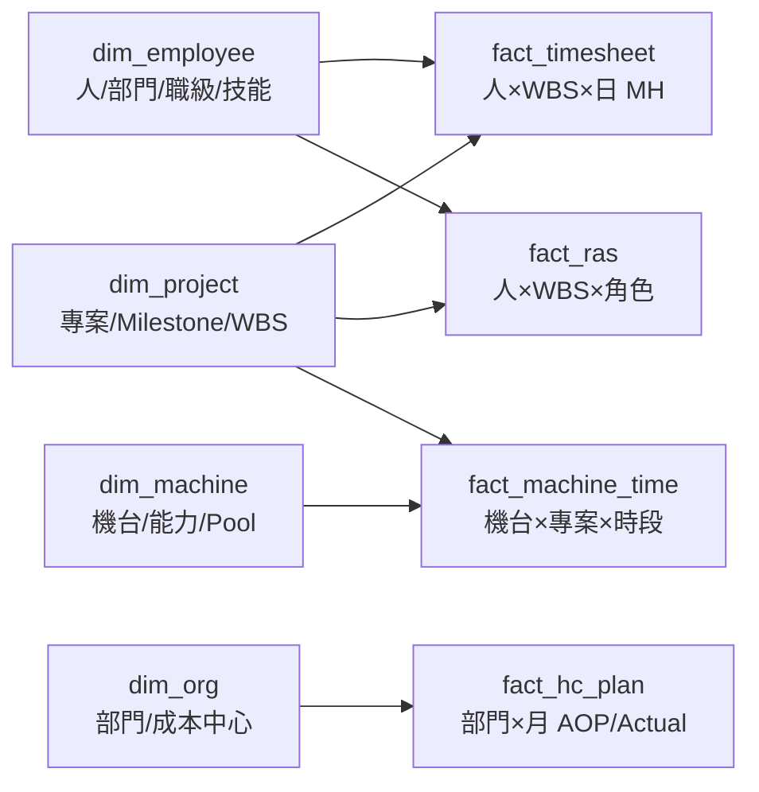
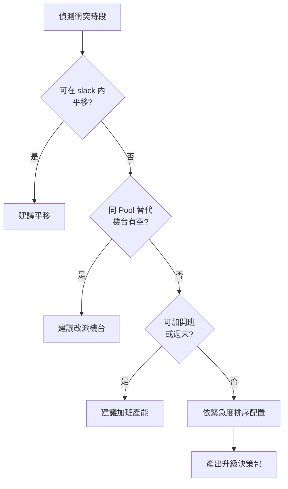
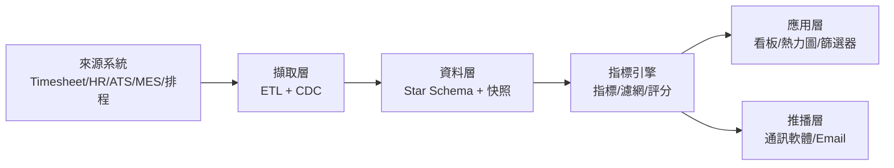

# 營運籌碼K線：RAS × HC AOP × M Time 營運決策系統規劃藍圖

2026-09-20 · @Someone

## 〇、文件定位與設計原則

本系統把 RAS、HC AOP、M Time 三套原本各自為政的管理資料，統一成「以週為 K 棒、以人時與機時為成交量」的單一決策介面，讓管理者像看籌碼一樣看資源流向。核心主張：**營運風險不在報表的總數，而在明細的流向與集中度**。

### 設計原則

1. **底層明細優先（Tick-level first）**：所有指標必須能從彙總值一路下鑽到「人 × 專案 × 週 × 工時」或「機台 × 專案 × 班別 × 時段」的原子紀錄，禁止只存彙總數。
2. **K 棒化時間軸**：預設粒度為週（W-K），可切換日 / 月 / 季；每根 K 棒保留 Open / High / Low / Close 四值（例：週初投入人時、週內峰值、週內谷值、週末結算值）。
3. **基準線先於警示**：所有警示皆以「計畫基準（AOP / Baseline）」或「歷史移動平均」為參照，避免絕對值誤判。
4. **可解釋的閾值**：每個閾值都是可配置參數，並記錄設定人、生效日與理由，供事後稽核。
5. **例外管理（Management by Exception）**：首頁只顯示「偏離者」，正常者折疊。

### 名詞與資料粒度

| 名詞 | 定義 | 最小粒度 |
| --- | --- | --- |
| 專案（Project） | 具 Priority 與 Tier 分級的交付單位 | 專案 × Milestone × WBS |
| 人時（MH, Man-Hour） | 實際登錄於專案的工時 | 人 × WBS × 日 |
| 人月（MM, Man-Month） | 以 1 MM = 每月標準工時（預設 168 h）換算 | 人 × 月 |
| 機時（EH, Equipment-Hour） | 機台 / 測試台被佔用時數 | 機台 × 專案 × 時段 |
| Tier-1 | 公司級關鍵晶片或客戶承諾專案 | 專案屬性 |
| Priority（P1–P4） | 資源調度優先序 | 專案屬性，可隨季調整 |
| 營運 K 棒 | 某指標在一個時間週期內的 OHLC 四值 | 指標 × 週 |

## 一、核心概念映射架構（Mapping Framework）

六組籌碼 K 線概念可一對一映射為營運指標；映射的關鍵是把「股票」換成「專案」、「券商分點 / 主力」換成「部門 / 關鍵人員」、「成交量」換成「人時與機時」。

### 1.1 總對照表

| # | 籌碼K線概念 | 金融語意 | 營運映射 | 營運語意 | 核心指標 | 主要資料來源 |
| --- | --- | --- | --- | --- | --- | --- |
| 1 | 券商分點進出明細（主力 TOP 15） | 哪些分點在買、買多少 | 資源流向明細（Resource Allocation Flow） | 哪些部門 / 人把工時投進哪個專案 | 部門淨投入人時、TOP 15 投入者、投入集中度 | 工時系統（Timesheet） |
| 2 | 買賣家數差、千張大戶持股% | 籌碼是集中還是渙散 | RAS 權責集中度、Key Person 過載、職責懸空率 | 權責是否集中於少數人、是否有人沒人管 | KPRI、No-A Rate、Multi-A Rate、Top-N 權責占比 | RAS 主檔 + 工時 |
| 3 | 主力成本線、均線扣抵 | 主力平均成本位置、均線下週方向 | HC 成本支撐線、落後人月補償線 | 實際人力是否守住 AOP 基準、未來幾週是否被扣抵往下 | HC Support Line、Lost MM、Catch-up MM | HR 系統、ATS、AOP |
| 4 | 河流圖 / 布林通道 | 價格位於歷史區間的哪個位置 | M Time 產能通道（Capacity Bands） | 機台利用率處於過載 / 健康 / 閒置哪一帶 | Utilization%、%B、Band Width | MES / 機台 Log / 排程系統 |
| 5 | 籌碼選股器（Screener） | 多因子條件一鍵選股 | 營運例外篩選器（Operation Exception Screener） | 一鍵撈出高風險專案與瓶頸資源 | 多因子布林條件 + 風險評分 | 上述全部 |
| 6 | 股市同學會（看板 / 熱搜 / 討論串） | 社群情報與熱度 | 專案情資看板、瓶頸熱搜榜、Context Log | 跨專案調度協作與衝突情報 | Heat Score、討論熱度、未結案調度請求數 | 系統內討論 + 推播紀錄 |

### 1.2 詞彙對應（統一 UI 用語）

| 金融詞 | 營運詞 | 說明 |
| --- | --- | --- |
| 個股 | 專案（或 Milestone） | 分析標的 |
| 分點 / 主力 | 部門 / 關鍵人員 | 資源提供者 |
| 成交量 | 人時（MH）/ 機時（EH） | 交易活動量 |
| 買超 | 淨投入增加（本期 MH − 前期 MH > 0） | 資源流入 |
| 賣超 | 淨投入撤出 | 資源流出（被抽調） |
| 持股比率 | 權責 / 投入占比 | 集中度 |
| 成本線 | AOP 基準線 | 支撐 / 壓力參照 |
| 乖離率 | AOP 偏離度 | 偏離基準程度 |
| 漲停 / 跌停 | 過載 / 閒置 | 極端狀態 |

### 1.3 共用資料模型（Star Schema）



所有事實表共用 `project_id`、`dept_id`、`week_id` 三個一致性維度（Conformed Dimensions），這是跨模組篩選器能運作的前提。

| 共用維度欄位 | 型別 | 說明 |
| --- | --- | --- |
| `project_id` | VARCHAR(20) | 專案代碼，含 `tier`（1–3）、`priority`（P1–P4）、`status` |
| `milestone_id` | VARCHAR(30) | 如 TO（Tape-out）、ES、CS、MP |
| `wbs_id` | VARCHAR(40) | 工作包；RAS 與工時的共同錨點 |
| `dept_id` | VARCHAR(10) | 部門 / 成本中心 |
| `emp_id` | VARCHAR(10) | 員工；含 `grade`、`is_key_talent`、`skill_tags[]` |
| `week_id` | CHAR(8) | ISO 週，如 `2026-W38` |
| `snapshot_date` | DATE | 快照日；所有指標保留歷史快照以支援 K 棒回放 |

## 二、RAS 模組：籌碼分點與大戶集中度透視

RAS 模組回答三個問題：哪些工作沒人負責（懸空）、哪些工作多人搶主責（重疊）、哪些人扛了太多（過載）。它把「名義權責」（RAS 表上的字母）與「實質投入」（工時）交叉比對，找出紙上有人、實際沒人的假覆蓋。

### 2.1 資料模型

**fact\_ras（權責明細，等同分點進出明細）**

| 欄位 | 型別 | 說明 |
| --- | --- | --- |
| `ras_id` | BIGINT PK | 流水號 |
| `wbs_id` / `project_id` / `milestone_id` | FK | 工作錨點 |
| `emp_id` / `dept_id` | FK | 被指派者 |
| `role` | ENUM(R,A,S) | 權責角色 |
| `alloc_pct` | DECIMAL(5,2) | 計畫投入比例（0–100） |
| `effective_from` / `effective_to` | DATE | 生效區間（支援歷史回放） |
| `assigned_by` / `assigned_at` | VARCHAR / DATETIME | 異動稽核 |
| `is_backup` | BOOLEAN | 是否為備援人選（計算 SPOF 用） |

**agg\_ras\_wbs\_weekly（每週 WBS 權責快照）**：`wbs_id`、`week_id`、`cnt_R`、`cnt_A`、`cnt_S`、`planned_MH`、`actual_MH`、`coverage_flag`（OK / NO\_A / MULTI\_A / NO\_R / GHOST）。

### 2.2 權責覆蓋率指標（Coverage Rate）

對每個活躍 WBS（未結案且當週有計畫工時）計算 A 人數與 R 人數：

```latex
A_w = \sum_i \mathbb{1}[role_{i,w}=A], \quad R_w = \sum_i \mathbb{1}[role_{i,w}=R]
```

| 旗標 | 判定條件 | 意義 |
| --- | --- | --- |
| NO\_A（缺主責） | A\_w = 0 | 無人對結果負責，最高風險 |
| MULTI\_A（權責重疊） | A\_w ≥ 2 | 決策權分散，易推諉或衝突 |
| NO\_R（缺執行） | R\_w = 0 | 有人負責、無人執行 |
| GHOST（幽靈覆蓋） | A\_w = 1 且 R\_w ≥ 1，但 Σ actual\_MH(R) < 20% × planned\_MH，連續 2 週 | 紙上有人，實際沒投入 |
| OK | A\_w = 1 且 R\_w ≥ 1 且非 GHOST | 健康 |

以 Milestone 關鍵度加權後的覆蓋率（c\_w 為權重：Tier-1 = 3、Tier-2 = 2、其他 = 1）：

```latex
CoverageRate = \frac{\sum_{w} c_w \cdot \mathbb{1}[flag_w = OK]}{\sum_{w} c_w}
```

```latex
NoARate = \frac{\sum_{w} c_w \cdot \mathbb{1}[A_w = 0]}{\sum_{w} c_w}, \quad MultiARate = \frac{\sum_{w} c_w \cdot \mathbb{1}[A_w \ge 2]}{\sum_{w} c_w}
```

職責懸空率（Vacancy Rate）= NoARate + NO\_R 比率 + GHOST 比率。建議閾值：CoverageRate ≥ 95% 綠、90–95% 黃、< 90% 紅；任何 Tier-1 WBS 出現 NO\_A 即時紅燈。

### 2.3 關鍵人員集中度指標（Key Person Risk Index, KPRI）

仿「千張大戶持股比率」，先算每人的權責負載，再算組織層級的集中度。

**個人權責負載**（r 為角色權重：A = 1.0、R = 0.8、S = 0.3；p 為優先序權重：P1 = 1.5、P2 = 1.0、P3 = 0.6、P4 = 0.3；t 為 Tier 權重：Tier-1 = 1.3、其他 = 1.0）：

```latex
RoleLoad_i = \sum_{w \in W_i} r(role_{i,w}) \cdot p(prio_w) \cdot t(tier_w)
```

**單點失效度**（該人為唯一 R 或 A、且無 `is_backup` 備援的 WBS 占比）：

```latex
SPOF_i = \frac{|\{w : i \text{ 為 } w \text{ 唯一 R/A 且無備援}\}|}{|W_i|}
```

**實際工時利用率**：U\_i = 近 4 週實際工時 ÷ 近 4 週標準工時。

**KPRI**（Cap 為可承受負載，預設 3.0，約等於 2 個 P1 主責；可依職級設定）：

```latex
KPRI_i = \frac{RoleLoad_i}{Cap_{grade(i)}} \cdot \sqrt{U_i} \cdot (1 + SPOF_i)
```

| KPRI 區間 | 狀態 | 系統行為 |
| --- | --- | --- |
| < 0.8 | 健康 | 無 |
| 0.8 – 1.2 | 滿載 | 黃燈，列入觀察名單 |
| 1.2 – 1.6 | 過載 | 紅燈，通知直屬主管，禁止新增 A 指派（需覆核） |
| > 1.6 | 瓶頸 | 深紅，進入瓶頸熱搜榜，觸發備援人選建議 |

**組織集中度（大戶持股比率）**：取 RoleLoad 排名前 5% 的人員，計算其占全部門負載比例；並以 HHI 衡量分散度。

```latex
KPC_{top5\%} = \frac{\sum_{i \in Top5\%} RoleLoad_i}{\sum_{i} RoleLoad_i}, \quad HHI = \sum_i \left(\frac{RoleLoad_i}{\sum_j RoleLoad_j}\right)^2 \times 10000
```

**權責家數差（買賣家數差）**：每專案每週的 ΔAssignees = 新增 R/A 人數 − 移除 R/A 人數。解讀比照籌碼：家數差為負且 KPC 上升 = 權責往少數人集中（籌碼集中），短期效率高但 SPOF 風險上升；家數差為正且 KPC 下降 = 權責分散（籌碼渙散），需檢查 MULTI\_A。

### 2.4 RAS 穿透熱力圖（Matrix Heatmap）規格

| 項目 | 規格 |
| --- | --- |
| 縱軸 | 團隊 → 角色 → 人員三層可展開；預設顯示團隊層，依 KPRI 最大值降冪 |
| 橫軸 | 專案 → Milestone → WBS 三層可展開；依 Priority、Tier、到期日排序 |
| 儲存格文字 | 角色字母（R / A / S，多角色以 `A/R` 表示）+ 投入比例 |
| 儲存格底色 | 實際投入人時 ÷ 計畫人時（Fulfillment）：< 50% 淺灰、50–90% 淺藍、90–110% 藍、> 110% 橘 |
| 欄位頭標記 | NO\_A = 紅色實心框、MULTI\_A = 紫色圓點、NO\_R = 橘色斜線、GHOST = 灰色虛框 |
| 列尾摘要欄 | 該列（人 / 團隊）KPRI 值 + 迷你 Sparkline（近 12 週） |
| 欄尾摘要列 | 該欄（WBS）A\_w、R\_w、coverage\_flag |
| 互動 | 點擊儲存格 → 側欄顯示該人該 WBS 的工時 K 棒與異動紀錄；框選多格 → 批次指派 / 移轉；時間滑桿回放歷史快照 |
| 篩選 | 部門、專案 Tier、Priority、僅顯示異常欄、僅顯示 KPRI > 1.2 人員 |
| 效能 | 前端虛擬捲動，單畫面上限 200 列 × 300 欄；超過則強制聚合至上一層 |

### 2.5 權責流動 Sankey 圖

| 項目 | 規格 |
| --- | --- |
| 節點層級 | 第 1 層部門 → 第 2 層專案 → 第 3 層 Milestone（可切換為 WBS 類型：設計 / 驗證 / 支援） |
| 流量寬度 | 選定期間實際人時（MH），可切換為計畫人時或 RoleLoad |
| 流量顏色 | 依目標專案 Priority：P1 深藍、P2 藍、P3 淺藍、P4 灰；「非專案 / 未登錄」固定為淺紅，凸顯漏損 |
| 對比模式 | Plan vs Actual 雙 Sankey 並列，或單圖以差值著色（多投入綠、少投入紅） |
| 節點提示 | 部門節點顯示：總 MH、流向 P1 比例、流向 TOP 3 專案；專案節點顯示：主要供給部門 TOP 5（即主力分點） |
| 警示規則 | 部門流向 P1 的比例低於 AOP 承諾比例 10 個百分點以上 → 節點外框轉紅 |
| 互動 | 點擊流線 → 列出構成該流量的人員 TOP 15 明細（即「主力進出 TOP 15」表） |

**TOP 15 投入者明細表欄位**：排名、人員、部門、本期 MH、前期 MH、淨增減（買賣超）、占專案總 MH%、角色、KPRI。

## 三、HC AOP 模組：主力成本線與營收達成率

HC AOP 模組把「名目人頭」換算成「有效產能人月」，再與 AOP 基準比對。股市看的是股價能否守住主力成本；這裡看的是有效人力能否守住 AOP 支撐線，以及跌破後要補多少人月才能回到交期。

### 3.1 資料模型

| 資料表 | 關鍵欄位 | 來源 |
| --- | --- | --- |
| `fact_hc_plan` | dept\_id、month、aop\_hc、aop\_cost、approved\_req\_cnt | AOP 年度計畫（季度可修訂，保留版本號 `aop_ver`） |
| `fact_hc_actual` | emp\_id、dept\_id、onboard\_date、exit\_date、transfer\_in/out\_date、fte\_ratio | HR 系統 |
| `fact_hiring_pipeline` | req\_id、dept\_id、project\_id、stage、planned\_start、expected\_start、offer\_date | ATS 招募系統 |
| `fact_hc_cost` | dept\_id、month、actual\_cost、currency | 財務 / 成本中心 |
| `dim_ramp_curve` | grade、month\_since\_onboard、productivity\_factor | 由 PMO 設定，可依職級不同 |

### 3.2 HC 成本支撐線（Support Line）

**有效人力（Effective HC）**：新人需爬坡，不能以人頭計。預設爬坡係數 ρ：第 1 月 0.3、第 2 月 0.5、第 3 月 0.7、第 4–6 月 0.85、之後 1.0；轉調人員視為第 3 月起算。

```latex
EffHC_t = \sum_{i \in Onboard_t} fte_i \cdot \rho(tenure_{i,t})
```

**預測人力（納入招募管線與流失）**：P(stage) 為各招募階段到職機率（預設：Sourcing 0.1、Interview 0.3、Offer 0.7、Accepted 0.9），a 為部門滾動 12 個月月流失率。

```latex
ProjHC_{t+k} = Onboard_t + \sum_{j \in Pipeline} P(stage_j) \cdot \mathbb{1}[start_j \le t+k] - KnownExit_{(t,t+k]} - a \cdot Onboard_t \cdot k
```

**四條參考線（主畫面同圖疊加）**

| 線名 | 金融對應 | 定義 | 呈現 |
| --- | --- | --- | --- |
| AOP 計畫線 | 主力成本線 | 各月 aop\_hc 累計人月 | 粗實線（深灰） |
| 名目人力線 | 收盤價 | 在職人頭（Onboard HC）累計人月 | 細實線（藍） |
| 有效產能線 | 還原權息價 | EffHC 累計人月 | 粗實線（藍），與名目線之間塗色 = 爬坡損耗 |
| 預測線 | 均線延伸 | ProjHC 往後 3–6 個月 | 虛線 + P10 / P90 信賴帶 |

**扣抵預警（均線扣抵）**：以 4 週移動平均觀察有效人力。若未來 4 週將「扣抵」掉的高值（已知離職、轉調、長假）大於即將加入的新值，均線必然下彎，系統提前標示。

```latex
DeductionSignal_t = \sum_{k=1}^{4} \left(KnownOut_{t+k} - ExpectedIn_{t+k}\right) > 0 \Rightarrow \text{均線下彎預警}
```

### 3.3 延遲聘僱量化（Delay Impact）

**單一職缺的流失人月**：職缺 j 計畫到職 s\_j^plan、實際（或預估）到職 s\_j^act，評估期截至 Milestone 日 T。流失量為兩條爬坡曲線在 \[s\_j^plan, T\] 間的面積差。

```latex
LostMM_j = \int_{s_j^{plan}}^{T} \rho(t - s_j^{plan})\,dt - \int_{s_j^{act}}^{T} \rho(t - s_j^{act})\,dt
```

**帶教稅（Onboarding Tax）**：每位新人於前 2 個月占用 mentor 0.2 FTE，列為負產能，避免「補人反而更慢」的效應被低估。

**交期衝擊推估**：W\_rem 為專案剩餘工作量（人月，來自 WBS 估算），φ 為流失人月落在關鍵路徑 WBS 的比例，EffHC\_cp 為關鍵路徑上的有效人力。

```latex
\Delta T_{milestone} \approx \frac{\varphi \cdot \sum_j LostMM_j + OnboardTax}{EffHC_{cp}} \quad (\text{月})
```

**落後人月補償線（Catch-up Line）**：要在 T 前完成剩餘工作，每月需額外補足的人月。若 CatchUp 大於部門可調度彈性（預設為 EffHC 的 10%），即判定「無法靠內部調度追回」，須升級處理。

```latex
CatchUp = \frac{W_{rem} - \sum_{t=now}^{T} ProjEffHC_t}{T - now}
```

| 輸出 | 用途 |
| --- | --- |
| Lost MM（按專案、按職缺） | 招募優先序排序依據 |
| ΔT（週） | 直接回填專案情資看板的「預估交期滑移」 |
| CatchUp MM / 月 | 調度決策：內部借調、外包、延後範疇 |

### 3.4 預算偏差指標（AOP 乖離率）

**AOP 偏離度**

```latex
Var\%_{HC} = \frac{CumActualMM - CumAOPMM}{CumAOPMM}, \quad Var\%_{Cost} = \frac{CumActualCost - CumAOPCost}{CumAOPCost}
```

**Burn-rate 消耗斜率**：以近 8 週累計成本做線性回歸取斜率 β\_act，與 AOP 同期斜率 β\_plan 比較。BurnRatio = β\_act ÷ β\_plan。

**短期乖離（仿股價乖離率）**：有效人力相對自身 4 週均線的偏離，用來抓突然的人力抽離。

```latex
Bias_4 = \frac{EffHC_t - MA_4(EffHC)}{MA_4(EffHC)}
```

**年底落點預測**：Landing = YTD 實際成本 + Σ（剩餘月份 ProjHC × 月均單位成本）；與全年 AOP 比較。

| 指標 | 綠 | 黃 | 紅 | 雙向判讀 |
| --- | --- | --- | --- | --- |
| Var%\_HC | ±5% 內 | 5–10% | > 10% | 負偏離 = 招募落後（交期風險）；正偏離 = 超編（成本風險） |
| BurnRatio | 0.95–1.05 | 0.85–0.95 或 1.05–1.15 | < 0.85 或 > 1.15 | 同上 |
| Bias\_4 | ±3% 內 | 3–6% | > 6% | 負 = 人力突然被抽走；正 = 臨時大量投入 |
| Landing vs AOP | ±3% 內 | 3–7% | > 7% | 供財務 / 經營層季檢 |

**警示邏輯**：單一指標黃燈只記錄；同一部門兩項以上黃燈或任一紅燈 → 推播部門主管；Var%\_HC 紅燈且該部門供給任一 Tier-1 專案 → 同步寫入該專案的情資看板。

## 四、M Time 模組：河流圖與產能負載通道

M Time 模組把每台機台 / 測試台的時間拆成互斥狀態，用固定水位帶與動態布林通道雙重判讀利用率，並在 P1 專案預約重疊前兩到四週發出尖峰競搶預警與排程建議。

### 4.1 機台時間拆解

時間狀態建議對齊 SEMI E10 設備狀態定義，便於與廠端 MES 資料介接；以下在需求的五類之外補上 Engineering 與 Non-scheduled 兩類，確保 24 小時可完整切分。

| 狀態碼 | 狀態 | 定義 | 計入可用時間 | 資料來源 |
| --- | --- | --- | --- | --- |
| PRD | Productive Time | 執行專案測試 / 驗證 | 是 | 機台 Log、排程完工回報 |
| SET | Setup Time | 換線、載具 / Load Board 更換、程式載入、校正 | 是 | 排程系統 |
| ENG | Engineering Time | 除錯、Test Program 開發、機台工程評估 | 是 | 工單類型 |
| SCH | Scheduled Maintenance | PM 保養、定期校驗 | 否 | 保養計畫 |
| UDT | Unscheduled Breakdown | 非預期故障、等料、等工程師 | 否 | 故障工單（含 MTTR） |
| IDL | Idle / Standby | 可用但無工作 | 是 | 推導：可用 − 已佔用 |
| NSC | Non-scheduled | 未排班、停機假日 | 否（不計入分母） | 班表 |

**fact\_machine\_time 欄位**：`machine_id`、`pool_id`（同能力機台群組）、`capability_tags[]`（如 ATE 平台型號、溫度範圍、Pin count）、`project_id`、`state`、`start_ts`、`end_ts`、`duration_h`、`booking_id`、`source_system`。

**核心指標**

```latex
AvailableTime = Total - NSC - SCH - UDT
```

```latex
Utilization = \frac{PRD + SET + ENG}{Total - NSC}, \quad Productive\% = \frac{PRD}{Total - NSC}
```

```latex
SetupRatio = \frac{SET}{PRD + SET}, \quad MTBF = \frac{\text{運轉時數}}{\text{故障次數}}, \quad MTTR = \frac{UDT}{\text{故障次數}}
```

Utilization 用於水位判讀；Productive% 用於衡量真正產出；SetupRatio > 25% 代表排程碎片化，應合併同類測試。

### 4.2 產能通道圖（Capacity Bands）

採「固定水位帶 + 動態布林通道」雙層設計：固定帶給管理共識，動態帶捕捉機台自身的異常。

| 區帶 | Utilization 範圍 | 顏色 | 意義 | 系統行為 |
| --- | --- | --- | --- | --- |
| 過載警示帶 | > 85% | 紅 | 無緩衝，任何故障即延誤 | 禁止新增非 P1 預約；推播 Pool 負責人 |
| 正常負載帶 | 70% – 85% | 綠 | 健康且保有彈性 | 無 |
| 低載觀察帶 | 50% – 70% | 黃 | 有餘裕 | 開放跨專案借用 |
| 閒置浪費帶 | < 50% | 灰 | 資產閒置 | 連續 4 週 → 列入資產檢討（轉移、共用、延後採購） |

**動態布林通道**：以機台（或 Pool）自身 12 週 Utilization 為基準，k 預設 2。

```latex
Upper = MA_{12} + k\sigma_{12}, \quad Lower = MA_{12} - k\sigma_{12}, \quad \%B = \frac{U_t - Lower}{Upper - Lower}
```

判讀：%B > 1 = 異常高於自身常態（突發需求）；%B < 0 = 異常低（可能故障未報或專案延宕）；通道寬度收斂到歷史 20% 分位以下 = 負載穩定，常預示下一波需求轉折。

**UI 規格：產能河流圖（River Chart）**

| 項目 | 規格 |
| --- | --- |
| 主圖 | X 軸為週（預設近 26 週 + 未來 8 週預約），Y 軸為時數百分比；以堆疊面積呈現 PRD / SET / ENG / IDL / SCH / UDT，形成「河流」 |
| 疊加層 | 固定水位帶以淡色橫帶鋪底；布林上下軌以虛線疊加；未來週以斜線紋區隔「預約」與「實績」 |
| 下方副圖 | 需求預約量（依 Priority 分色的柱狀），對應股市的成交量副圖 |
| 切換 | 單機台 / Pool / 全廠；Utilization / Productive% 兩種口徑 |
| 下鑽 | 點任一週 → 甘特圖（機台 × 時段 × 專案） |

### 4.3 資源排擠與衝突檢測（Peak Congestion Alert）

**需求負載率**：對每個 Pool p、時段 s（預設以班別或日為單位），計算 P1 預約時數占可用時數比例。

```latex
Load_{p,s}^{P1} = \frac{\sum_{b \in Booking_{p,s},\, prio_b = P1} h_b}{AvailableTime_{p,s}}, \quad Load_{p,s}^{all} = \frac{\sum_{b} h_b}{AvailableTime_{p,s}}
```

| 觸發層級 | 條件 | 提前量 | 通知對象 |
| --- | --- | --- | --- |
| 關注 | Load^all > 90% | 4 週 | Pool 負責人 |
| 預警 | Load^all > 100%，或 Load^P1 > 85% | 4 週 | Pool 負責人 + 相關專案 PM |
| 尖峰競搶 | Load^P1 > 100%（僅 P1 即超載） | 2–4 週 | 上述 + 部門主管；進入瓶頸熱搜榜 |
| 危機 | Load^P1 > 100% 且含 Tier-1 驗證，且可移動餘裕為 0 | 即時 | 上述 + 營運主管；觸發調度會議 |

**自動建議演算法（Phase 1：規則式；Phase 2：CP-SAT 最佳化）**



1. **平移**：讀取每筆預約的最早開始 / 最晚完成（由專案排程的 slack 推得），能在不影響 Milestone 下移開即建議平移，並以最小平移量優先。
2. **改派**：依 `capability_tags` 在同 Pool 或相容 Pool 尋找空檔；需考慮 Setup 成本，若改派造成額外 Setup > 原預約 15%，降低建議分數。
3. **加班產能**：以班表可開放的額外時數試算，附上加班成本。
4. **依緊急度配置**：仍無法解時，以緊急度分數由高至低配置，低分者延後。

```latex
Urgency_b = p(prio_b) \cdot t(tier_b) \cdot (1 + CP_b) \cdot \frac{1}{\max(1,\, slack\_days_b)}
```

CP\_b 為該預約是否位於關鍵路徑（是 = 1、否 = 0）；p、t 權重同 2.3。

5. **升級決策包**：列出每個方案（誰延後、延後幾天、影響哪個 Milestone、ΔT、成本），交由營運主管拍板；決策結果回寫 Context Log，作為日後權重調校依據。

## 五、營運例外篩選器（Operation Exception Screener）

篩選器提供五組預設濾網（A–E），每組都是跨模組的布林條件組合，管理者一鍵套用即得清單與建議處置；使用者也可自組條件並存成個人或團隊濾網。

### 5.1 篩選引擎規格

| 項目 | 規格 |
| --- | --- |
| 標的層級 | 專案、Milestone、部門、人員、機台 Pool（每組濾網宣告其標的） |
| 因子庫 | 第二至四章所有指標，皆以 `module.metric` 命名，如 `ras.no_a_cnt_cp`、`hc.var_pct`、`mt.load_p1_4w` |
| 運算子 | `> >= < <= = !=`、`BETWEEN`、`IN`、`EXISTS`、`CONSECUTIVE(n週)`、`CROSS_ABOVE / CROSS_BELOW`（突破 / 跌破） |
| 時間窗 | 當週、近 N 週、未來 N 週（預約 / 預測值） |
| 執行頻率 | 每日 06:00 批次；使用者可即時手動執行 |
| 輸出 | 命中清單 + 各條件實際值 + 風險分數 + 建議處置 + 一鍵建立調度討論串 |
| 版本 | 濾網參數變更留存版本，支援「以舊參數回測過去 12 週命中率」 |

**濾網定義 DSL（範例：濾網 A）**

```yaml
screener_id: SCR-A
name: 交期破口型
target: project
logic: ALL
conditions:
  - factor: pm.schedule_slip_days
    op: ">="
    value: 5
  - factor: hc.actual_vs_aop_ratio
    op: "<"
    value: 0.80
  - factor: ras.no_a_cnt_cp
    op: ">="
    value: 1
severity: critical
actions: [ACT-A1, ACT-A2, ACT-A3]
owner_notify: [project_pm, dept_head]
```

**命中排序：綜合風險分數**（各條件以超越閾值的幅度正規化到 0–1，w\_k 為條件權重，I\_proj 為專案重要度 = p × t）

```latex
RiskScore = 100 \cdot I_{proj} \cdot \frac{\sum_k w_k \cdot \min\left(1, \frac{|x_k - \theta_k|}{\theta_k}\right)}{\sum_k w_k}
```

### 5.2 濾網 A：交期破口型

**情境**：專案已落後、人不夠、又有關鍵工作沒人負責，三者疊加代表交期破口正在擴大。

| 條件 | 因子 | 觸發閾值 | 來源 |
| --- | --- | --- | --- |
| A1 進度落後 | `pm.schedule_slip_days` 或 SPI | 落後 ≥ 5 工作天，或 SPI < 0.90 | 專案排程 |
| A2 人力不足 | `hc.actual_vs_aop_ratio` | 專案實際有效人月 < AOP 80% | 3.2 |
| A3 權責懸空 | `ras.no_a_cnt_cp` | 關鍵路徑 WBS 中 NO\_A ≥ 1 | 2.2 |

**建議處置**

1. ACT-A1：48 小時內由部門主管指定 NO\_A 工作包的 Accountable，系統鎖定該 WBS 直到指派完成。
2. ACT-A2：依 3.3 CatchUp 計算補償人月，產出內部借調候選名單（技能匹配且 KPRI < 0.8 者）。
3. ACT-A3：若 CatchUp 大於部門彈性，PM 於一週內提交範疇調整或 Milestone 重排提案。

### 5.3 濾網 B：資源斷崖型

**情境**：關鍵晶片驗證即將撞上機台產能牆。

| 條件 | 因子 | 觸發閾值 | 來源 |
| --- | --- | --- | --- |
| B1 機時需求超載 | `mt.demand_ratio_4w` | 未來 4 週預估需求 ÷ 可用機時 > 120% | 4.3 |
| B2 含 Tier-1 驗證 | `project.tier` + `wbs.type` | Tier = 1 且 WBS 類型屬驗證（CP / FT / SLT / 可靠度） | 專案主檔 |
| B3（加重）替代不足 | `mt.alt_pool_free_h` | 相容 Pool 空檔 < 缺口的 30% | 4.3 |

**建議處置**

1. ACT-B1：自動執行 4.3 建議演算法，產出平移 / 改派 / 加班三方案與成本。
2. ACT-B2：凍結該 Pool 未來 4 週內 P3–P4 預約，釋出時數優先給 Tier-1。
3. ACT-B3：B3 同時成立時，觸發外部測試產能（委外測試廠）詢價流程，並告知採購。

### 5.4 濾網 C：關鍵人斷點型

**情境**：一位扛太多、又沒備援的人，是整個專案組合的單點失效。

| 條件 | 因子 | 觸發閾值 | 來源 |
| --- | --- | --- | --- |
| C1 過載 | `ras.kpri` | KPRI > 1.6 且連續 2 週 | 2.3 |
| C2 無備援 | `ras.spof` | SPOF > 50% | 2.3 |
| C3 牽動關鍵專案 | `ras.tier1_role_cnt` | 在 ≥ 2 個 Tier-1 / P1 專案擔任 R 或 A | 2.3 |
| C4（加重）可用性事件 | `hc.planned_absence_8w` | 未來 8 週有已核定的轉調、長假或外派 | HR 系統 |

**建議處置**

1. ACT-C1：為每個 SPOF 工作包指定備援（`is_backup`），並安排 2–4 週 shadowing。
2. ACT-C2：將其至少一個 A 角色移轉給資深 R，目標使 KPRI 降至 1.2 以下。
3. ACT-C3：C4 成立時，列為經營層關注人員，要求於事件發生前 4 週完成交接計畫。

> 隱私原則：C4 僅使用已核定的出缺勤與異動事件，不引用任何離職傾向預測或個人評價資料；人員層級清單僅對直屬主管以上可見。

### 5.5 濾網 D：燒錢無進度型（幽靈投入）

**情境**：成本照燒、工時照報，但交付沒有前進，常見於權責名實不符或需求反覆變更。

| 條件 | 因子 | 觸發閾值 | 來源 |
| --- | --- | --- | --- |
| D1 消耗偏快 | `hc.burn_ratio` | BurnRatio > 1.10 | 3.4 |
| D2 進度偏慢 | `pm.cpi` 或 `pm.progress_vs_plan` | CPI < 0.90，或完成度落後計畫 ≥ 10 個百分點 | 專案排程（EVM） |
| D3 名實不符 | `ras.ghost_cnt` 或 `flow.non_project_share` | GHOST WBS ≥ 3，或非專案工時占比 > 25% | 2.2、2.5 |

**建議處置**

1. ACT-D1：PM 與部門主管召開 30 分鐘 WBS 盤點，確認 GHOST 工作包是結案、改派或重估。
2. ACT-D2：檢查近 4 週需求變更次數；若 ≥ 3 次，啟動變更凍結（Change Freeze）。
3. ACT-D3：非專案工時占比過高者，要求工時登錄細分到 WBS，兩週後重跑濾網驗證。

### 5.6 濾網 E：資源錯配型（機會篩選）

**情境**：同一時間有人閒、有人爆，屬「可立即改善」的機會，而非風險。

| 條件 | 因子 | 觸發閾值 | 來源 |
| --- | --- | --- | --- |
| E1 閒置端 | `mt.utilization_4w` 或 `ras.kpri` | 某 Pool 利用率 < 50% 連續 4 週，或某團隊平均 KPRI < 0.6 | 4.2、2.3 |
| E2 過載端 | 同上 | 相容 Pool 利用率 > 90%，或技能相符團隊平均 KPRI > 1.2 | 4.2、2.3 |
| E3 可移轉 | `capability_match` / `skill_match` | 能力標籤或技能標籤重疊 ≥ 70% | 維度主檔 |

**建議處置**

1. ACT-E1：產出配對建議（閒置端 → 過載端），附預估可釋放機時 / 人月。
2. ACT-E2：配對成立後建立跨部門借調或機台共用單，雙方主管一鍵核可。
3. ACT-E3：閒置 Pool 連續 12 週命中者，列入次年度 AOP 資本支出檢討。

### 5.7 篩選器 UI

| 元件 | 規格 |
| --- | --- |
| 濾網庫 | 左側列出預設濾網 A–E、團隊共享濾網、個人濾網；顯示今日命中數與較上週增減 |
| 條件編輯器 | 拖拉式因子積木 + 閾值滑桿，即時預覽命中數（類似選股器的「符合檔數」） |
| 結果表 | 標的、風險分數、各條件實際值（超標者紅字）、Sparkline、建議處置、負責人、狀態 |
| 批次動作 | 勾選多筆 → 建立討論串、指派處置、加入追蹤清單、匯出 |
| 回測面板 | 顯示該濾網過去 12 週命中數，以及命中後 8 週內真正發生交期滑移的比例（精準度） |

## 六、協作與警示機制：同學會社群與即時推播

協作層把指標轉成行動：每個專案有一張「個股頁」式的情資看板，所有調度與決策都留在 Context Log；每日與每週自動產出瓶頸熱搜榜，推播到主管儀表板與通訊群組。

### 6.1 專案情資看板（Project Intel Board）

| 區塊 | 位置 | 內容 | 金融對應 |
| --- | --- | --- | --- |
| 標頭 | 頂部 | 專案名、Tier、Priority、下一個 Milestone 倒數天數、健康燈號、預估交期滑移 ΔT | 個股報價列 |
| 三模組迷你 K 線 | 上半部三欄 | RAS：CoverageRate 週 K + NO\_A / MULTI\_A 數；HC：Var%\_HC 與有效產能線；M Time：該專案占用 Pool 的 Load^P1 河流圖 | 技術線圖 |
| 主力進出 | 中段左 | 投入人時 TOP 15（本期、前期、淨增減、角色、KPRI） | 分點進出 |
| 篩選器命中 | 中段右 | 本專案目前命中的濾網、命中天數、處置進度 | 選股器標籤 |
| 大事記 | 中段下 | 系統自動事件時間軸：RAS 異動、到離職、機台故障、Milestone 變更 | 個股重大訊息 |
| Context Log | 下半部 | 異動備忘錄與調度討論串 | 個股討論區 |

**Context Log 資料模型（fact\_context\_log）**

| 欄位 | 型別 | 說明 |
| --- | --- | --- |
| `log_id` / `parent_id` | BIGINT | 主文與回覆（討論串結構） |
| `project_id` | FK | 所屬專案 |
| `log_type` | ENUM | MEMO（異動備忘）、REQUEST（調度請求）、DECISION（決策紀錄）、RISK（風險揭露）、SYSTEM（系統自動事件） |
| `linked_entity` | JSON | 關聯物件：`{type: wbs / emp / machine / booking / screener_hit, id}` |
| `body` | TEXT | 內文，支援 @提及 人員或部門 |
| `author_id` / `created_at` | FK / DATETIME | 發文者 |
| `status` | ENUM | OPEN、ACK、RESOLVED、REJECTED（REQUEST / RISK 適用） |
| `due_date` / `sla_hours` | DATE / INT | 回應期限；REQUEST 預設 SLA 2 個工作日 |
| `resolution` / `linked_action_id` | TEXT / FK | 結論與對應的處置單 |
| `visibility` | ENUM | PROJECT（專案成員）、MGMT（主管以上） |

**協作規則**

1. 任何 RAS 指派變更、機台預約改派、跨部門借調，系統強制產生一筆 SYSTEM 紀錄並要求填寫一行異動理由，避免「沒人知道為什麼改」。
2. REQUEST 逾 SLA 未回應 → 自動升級給對方部門主管；逾 2 倍 SLA → 列入熱搜榜「未回應調度」加分項。
3. DECISION 紀錄為唯讀，只能以新紀錄補充，作為日後稽核與權重調校依據。
4. 跨專案衝突（同一機台 / 同一關鍵人被兩個專案爭取）自動開啟「聯合討論串」，同時出現在雙方看板。

### 6.2 瓶頸熱搜榜（Bottleneck Top 10）

熱搜榜分三個子榜 + 一個綜合榜，每榜 10 名，並顯示名次升降（▲▼）、新上榜、連續上榜週數。

| 子榜 | 標的 | 排序分數 | 分數來源 |
| --- | --- | --- | --- |
| 最缺工榜 | 專案 | StaffGap = CatchUp MM × I\_proj（CatchUp ≤ 0 不入榜） | 3.3 |
| 機台最擠榜 | 機台 Pool（附受影響專案） | Crowd = 未來 4 週 max(Load^P1) × Σ 受影響專案 I\_proj | 4.3 |
| 權責最不明確榜 | 專案 | Ambiguity = 3 × NO\_A + 2 × MULTI\_A + 2 × GHOST + 1 × NO\_R（皆為關鍵度加權件數） | 2.2 |
| 綜合熱搜榜 | 專案 | HeatScore（見下式） | 全部 |

**HeatScore**：Risk 為第五章 RiskScore 之最大值，Trend 為較上期的惡化幅度，Buzz 為討論熱度（近 7 日 Context Log 新增數 + 未結 REQUEST 數 × 2 + 逾 SLA 數 × 3）；三者皆以 min-max 正規化為 0–1。

```latex
HeatScore = 100 \cdot \left(0.5 \cdot \widehat{Risk} + 0.3 \cdot \widehat{Trend} + 0.2 \cdot \widehat{Buzz}\right)
```

Buzz 權重刻意壓低到 0.2，避免「最會吵的專案」排到前面；它的作用是反映「已有人在處理但卡住」的訊號。

### 6.3 推播機制

| 推播類型 | 頻率 / 時間 | 對象 | 通道 | 內容 |
| --- | --- | --- | --- | --- |
| 即時警示 | 事件觸發 | 相關 PM、部門主管 | 通訊軟體私訊 + 系統通知 | 危機等級：Tier-1 NO\_A、Load^P1 危機、濾網 A / B 新命中 |
| 每日早報 | 工作日 08:30 | 部門主管以上 | 主管儀表板 + 群組 | 綜合熱搜榜 TOP 10、昨日新命中、逾 SLA 請求 |
| 每週週報 | 週一 08:00 | 副理以上、營運主管 | 群組 + Email | 三子榜 TOP 10、名次變化、各模組健康度週 K、上週決策摘要 |
| 月度檢討 | 每月第 1 個工作日 | 經營層 | 報表 | AOP Landing、閒置資產、濾網回測精準度 |

**推播訊息範本（每日早報單則）**

```markdown
【營運熱搜 #1 ▲2】專案 X（Tier-1 / P1）HeatScore 87
• 最缺工：CatchUp 2.4 MM/月，預估 TO 滑移 3 週
• 權責：關鍵路徑 NO_A ×2（DV 簽核、Timing Closure）
• 命中濾網：A 交期破口型（第 4 天）
• 待辦：DV 簽核 A 指派（逾期 1 天）→ [開啟情資看板]
```

**防疲勞設計**

1. 冷卻期：同一標的同一警示 72 小時內不重複推播，除非分數再惡化 ≥ 20%。
2. 合併：同一人同時段多則警示合併為一則摘要。
3. 訂閱：使用者可依專案、部門、濾網訂閱或靜音（危機等級不可靜音）。
4. 回饋鈕：每則推播附「有用 / 無用」，每月據此調整閾值與權重。

## 七、系統架構、資料治理與分階段落地

建議分三階段、約 9 個月落地：先用現有工時與 RAS 資料做出「看得見」的熱力圖與篩選器，再接 HC 與機台資料，最後才上最佳化排程與預測模型。成敗關鍵在資料品質，而非演算法。

### 7.1 系統分層架構



| 層級 | 職責 | 擴充彈性設計 |
| --- | --- | --- |
| 擷取層 | 每日批次 + 關鍵事件 CDC（RAS 異動、機台故障） | 每個來源一個 Adapter，新增來源不動核心 |
| 資料層 | 一致性維度、事實表、每週快照（保留 ≥ 3 年） | 快照讓所有 K 線可回放；新增管理標的只需新增事實表並掛上共用維度 |
| 指標引擎 | 指標定義以設定檔（Metric Registry）管理：名稱、公式、粒度、閾值、版本 | 新指標 = 新增一筆 Registry，篩選器自動可用 |
| 應用層 | Web 儀表板；元件：熱力圖、Sankey、河流圖、K 線、篩選器、看板 | 元件化，可嵌入既有 Portal |
| 推播層 | 規則引擎 + 通道 Adapter | 新通道只需新增 Adapter |

**Metric Registry 範例**

```yaml
metric_id: ras.kpri
name: 關鍵人員風險指數
grain: [emp_id, week_id]
formula_ref: kpri_v1
params:
  role_weight: {A: 1.0, R: 0.8, S: 0.3}
  prio_weight: {P1: 1.5, P2: 1.0, P3: 0.6, P4: 0.3}
  tier1_weight: 1.3
  cap_by_grade: {default: 3.0}
thresholds: {yellow: 0.8, red: 1.2, critical: 1.6}
version: 1
owner: OMO
```

### 7.2 資料治理

| 議題 | 規範 |
| --- | --- |
| 工時品質 | 工時必須登錄到 WBS 層級；每週五截止，未登錄率 > 5% 的部門於週報標示，其指標加註「資料信賴度低」 |
| RAS 主檔 | 每個 WBS 建立時強制填 A；RAS 異動需填理由；每季全面校閱 |
| 單一真相來源 | 專案主檔（Tier / Priority）由 PMO 維護；HC 由 HR；機台狀態由 MES；本系統只讀不改來源 |
| 權限 | 部門彙總全員可見；人員層級（KPRI、個人工時）僅直屬主管以上；Context Log 依 `visibility` 控管 |
| 閾值治理 | 閾值與權重變更需經營運主管核可，留存版本；每季依濾網回測精準度與推播回饋調校 |
| 使用倫理 | 本系統衡量「資源配置與流程風險」，KPRI 等人員指標不作為個人績效考核依據，避免工時灌水與權責逃避 |

### 7.3 分階段落地路線

| 階段 | 期間 | 範圍 | 交付物 | 成功指標 |
| --- | --- | --- | --- | --- |
| Phase 1 MVP | 第 1–3 月 | RAS + 工時；一致性維度；濾網 A（簡化版）、C | RAS 熱力圖、Sankey、TOP 15、權責最不明確榜 | Tier-1 專案 NO\_A 歸零；工時 WBS 登錄率 ≥ 95% |
| Phase 2 擴充 | 第 4–6 月 | 接 HR / ATS / 財務與 MES；HC 與 M Time 模組 | HC 四線圖、Lost MM、河流圖、尖峰預警（規則式建議）、濾網 A–E 完整版、情資看板、推播 | 尖峰競搶提前 ≥ 2 週預警比率 ≥ 80%；主管週活躍率 ≥ 70% |
| Phase 3 智慧化 | 第 7–9 月 | CP-SAT 排程最佳化；ΔT 預測模型校準；濾網回測 | 最佳化排程建議、預測信賴帶、閾值自動建議 | ΔT 預測誤差 ≤ ±1 週；濾網 A 命中後實際滑移比例 ≥ 60% |

### 7.4 待確認事項

1. 工時系統目前是否已登錄到 WBS 層級，或僅到專案層級（決定 Phase 1 能否直接上 GHOST 判定）。
2. 機台時間資料是否能從 MES 取得狀態碼，或僅有排程預約資料（決定 4.1 七狀態能否全數自動化）。
3. Priority 與 Tier 的核定權責單位與調整頻率。
4. 推播通道（Teams、Email 或其他內部通訊軟體）與資安限制。
